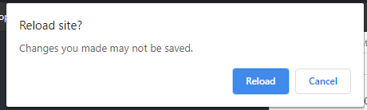

# Actions when page unload(refresh or close window)

- User prompt for custom action.
- notistack used for prompt UI.



```js
// index.js
ReactDOM.render(
  <React.StrictMode>
    <SnackbarProvider preventDuplicate maxSnack={3}>
      <App />
    </SnackbarProvider>
  </React.StrictMode>,
  document.getElementById("root")
);

// App.js
// https://github.com/jacobbuck/react-beforeunload/blob/master/src/useBeforeunload.js
const [message, setmessage] = useState("");
const { enqueueSnackbar, closeSnackbar } = useSnackbar();

let handled;
useEffect(() => {
  const handleBeforeunload = (event) => {
    if (handled) return;

    const saveTask = async (key) => {
      function async_sleep(ms) {
        return new Promise((resolve) => setTimeout(resolve, ms));
      }
      await async_sleep(500);
      handled = true;
      closeSnackbar(key);
      window.close();
    };

    // save toast:
    // https://iamhosseindhv.com/notistack/demos#customizing-snackbars-individually
    const action = (key) => (
      <>
        <br />
        <Button onClick={() => saveTask(key)}>Save</Button>
        <Button onClick={() => closeSnackbar(key)}>Cancel</Button>
      </>
    );

    const warn_msg = "You have to save recording before exit!";
    enqueueSnackbar(warn_msg, {
      variant: "info",
      anchorOrigin: {
        vertical: "bottom",
        horizontal: "right",
      },
      persist: true,
      action: action,
    });

    // show warn popup.
    // Chrome requires `returnValue` to be set.
    // Some browsers like chrome display a fixed message.
    event.returnValue = warn_msg;
    return event.returnValue;
  };

  window.addEventListener("beforeunload", handleBeforeunload);

  return () => {
    window.removeEventListener("beforeunload", handleBeforeunload);
  };
}, []); // eslint-disable-line react-hooks/exhaustive-deps
```
